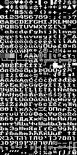
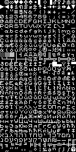
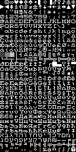
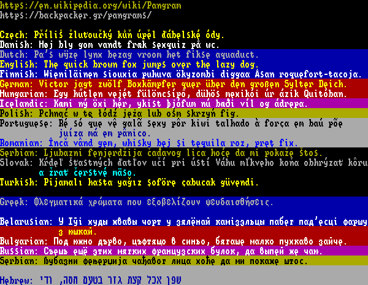
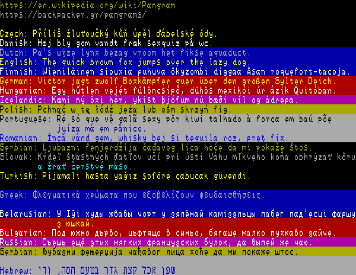
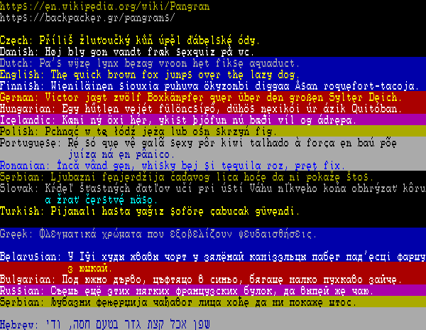

# 512-character, 8x8 bitmap, monospace font

| Bold                              | Sans                              | Serif                               |
| --------------------------------- | --------------------------------- | ----------------------------------- |
|  |  |  |

## Purpose

This font is for use in e.g. embedded/FPGA/SBC projects, computer emulators,
retro games.

## License

Public Domain

## Pros

* small memory footprint (512 8x8 characters occupy just 4KB)
* trivially scalable (from 8x8 to 8x16 or 16x16) in hardware or software,
  that is, this single font can be used at different screen resolutions,
  which is especially useful when the resolution is switchable
* decent support for Latin, Greek, Cyrillic and Hebrew scripts, covering
  approximately 50 languages
* contains a number of symbols in common use (math, punctuation, quotation,
  line/box-drawing)
* can be used with 8-bit code pages (e.g. IBM437, Windows-1251, ISO/IEC
  8859-8) or Unicode
* for ease of porting of existing PC software and text, the first 256 chars
  of the font fall somewhere between code pages 437 and 850/858

## Cons

* not as nice or consistent as taller fonts (e.g. 8x14 or 8x16) since there
  isn't much space vertically for top and bottom diacritics; a few basic
  characters (a, e, s, в, з, э, є) are also affected; various compromises
  made
* some very similarly or identically looking characters share common
  appearance and are thus visually indistinguishable (e.g. 3 and З, B and В)
* likewise, some less fortunate characters that don't get to have their own
  distinct representation in the font are approximated by the ones that do
  (e.g. ϊ -> ï, Ș -> Ş, Ǧ -> Ğ <- Ĝ; rationale: however wrong, it's
  probably better to show something recognizable and meaningful than nothing
  at all or a catch-all character like a box or U+FFFD <?>)

## Viewing the font

* You can simply open one of the 512_8_\*.txt files (e.g.
  [512_8_bold.txt](512_8_bold.txt)) in a text editor (must be opened in
  UTF-8 encoding and viewed with a monospace font).

* Here are a few pangrams prerendered with the vertically doubled font:
  | Style |                                                     |
  | ----- | --------------------------------------------------- |
  | Bold  |    |
  | Sans  |    |
  | Serif |  |

## Trying out the font

* You can install the supplied 512x\*.ttf fonts in your OS and try them out
  in a web browser or a word processor. For typical applications you should
  prefer taller/vertically doubled fonts, e.g.
  [512x16Bold.ttf](512x16Bold.ttf) over the original non-doubled
  512x8Bold.ttf.

* You can also use the included test text files (all UTF-8 encoded),
  [code_pages.txt](code_pages.txt) and [pangrams.txt](pangrams.txt) to see
  if all of the supported font characters are rendered correctly in your
  project.

## Aesthetic details

Currently, there are 3 styles of the font:

* bold
  * noticeably partially serif due to space constraints
  * most legible due to thickness and good contrast
  * recommended
* sans (that is, sans serif, IOW, without serifs)
  * thin, with worse contrast (text colors should be chosen carefully or
    adjusted for this style)
  * next best after bold
* serif (most letters have serifs)
  * least legible due to serifs themselves or due to their effect on
    the rest of the character shape
  * kinda cute
  * to be used sparingly and mindfully, perhaps, for artistic effect

## Character approximations/substitution

* Substituted/approximated letters and letter-like characters:  
  ĈĉĊċĔĕĜĝĠĤĥĦħĨĩĬĭĴĵĿŀŌōŎŏŖŗŜŝŨũŬŭ  
  ƒ  
  ǍǎǦǧǺǻǼǽǾǿȘșȚț  
  ɒɔɛɜɪʃʊʌƷʒ  
  ίιϊ  
  ḂḃḊḋḞḟṀṁṖṗṠṡṪṫẀẁẂẃẄẅỲỳ
* Other substituted/approximated characters:  
  ‗’‚‼↨∟⌐▬♫✓

## "Code page" of the font

You can use the font's first 256 characters as if it had its own code page.
The following information may be useful for that.

The font is closer to code page 850/858 than to code page 437. CP850/858
brings in additional Latin characters with diacritics that are needed in
several major Latin-based languages. These "new" characters replace the
less valuable line/box-drawing characters and the far incomplete set of
Greek characters of CP437. This part is mostly the same in the font as in
CP850/858.

However, some of CP437 characters that CP850 replaces are brought back
in the font (most notably in the range 0xF0 through 0xFF).

Still, a few more characters are replaced with characters not found in
either CP437 or CP850/858.

Here's an attempt to summarize the differences in the first 256 characters
between this font and code pages 437 and 850:

          Code   Font   Approxi-  CP437  CP850
    Char  Point  Index  mation    Index  Index
       ☻  U+263B   n/a       n/a     02     02
       ∞  U+221E   002               EC
       ◘  U+25D8   n/a       n/a     08     08
       ◙  U+25D9   n/a       n/a     0A     0A
       ♫  U+266B               ♪     0E     0E
       Š  U+0160   00E
       ‼  U+203C               !     13     13
       š  U+0161   013
       ▬  U+25AC               ─     16     16
       ≠  U+2260   016
       ↨  U+21A8               ↕     17     17
       Ž  U+017D   017
       ∟  U+221F               └     1C     1C
       ž  U+017E   01C
       ⌂  U+2302   07F         Δ     7F     7F
    ------------------------------------------
       ₧  U+20A7   n/a       n/a     9E
       ƒ  U+0192               f     9F     9F
       ẞ  U+1E9E   09F
       ⌐  U+2310               ┌     A9
       ı  U+0131   11F                      D5
       €  U+20AC   0D5
       ¦  U+00A6   17E                      DD
       ▌  U+258C   008               DD
       Ÿ  U+0178   0DD
       ▐  U+2590   00A               DE
       ¯  U+00AF   n/a       n/a            EE
       ∩  U+2229   n/a       n/a     EF
       ≡  U+2261   0F0               F0
     SHY  U+00AD               -            F0
       ≥  U+2265   0F2               F2
       ‗  U+2017               _            F2
       ≤  U+2264   0F3               F3
       ¾  U+00BE   0EE                      F3
       ⌠  U+2320   1FC               F4
       ¶  U+00B6   014               14  14,F4
       Π U+0152   0F4
       ⌡  U+2321   1FD               F5
       §  U+00A7   015               15  15,F5
       œ  U+0153   0F5
       ≈  U+2248   0F7               F7
       ¸  U+00B8               ,            F7
       ∙  U+2219               ·     F9
       ¨  U+00A8   n/a       n/a            F9
       ™  U+2122   0F9
       √  U+221A   0FB               FB
       ¹  U+00B9   0FF                      FB
       ⁿ  U+207F   1FB               FC
       ³  U+00B3   0FC                      FC
    NBSP  U+00A0              " "    FF     FF

That is, there are several CP437 and CP850 characters completely absent from
this font, without substitution/approximation. Likewise, there are some not
found in either.

## Technical details

* Using with 8-bit code pages  
  You can create a look-up table to translate character codes (0 to
  255) of your chosen code page (e.g. CP866) into indices into this
  font (0 to 511).
* Using with Unicode  
  Use binary search or a hash table to translate each Unicode code
  point into an index into this font.
  * Binary search (needs less memory but is slower)  
    The generated 512_8_\*.tab files list the translation key-value
    pairs as arguments in CDPT() and FIDX() (note that the code points
    for ASCII chars are not included to save space and search time).
  * Hash table (needs more memory but is faster)  
    If you prefer a hash table instead, the generated 512_8_\*.hsh
    files contain a simple hash table implementation. The table has
    256 buckets indexed by 8 least significant bits of Unicode code
    point. Each argument in HTVAL() contains another 7 (that is,
    more significant) bits of the code point (in bits 14 through 8)
    and the font index (in bit 15 and bits 7 through 0). This limits
    the supported code point values to at most U+7FFF (again the code
    points for ASCII chars are not included to save space and search
    time). Currently, at most 6 code points hash into the same bucket.
    Unused slots in each bucket, if any, are filled with 0xFFFF.
* The last character in the font is special, it must be U+FFFD <?>.

## Changing the font

1. Modify e.g. [512_8_bold.txt](512_8_bold.txt).
   It should be pretty straightforward.
2. Regenerate derivative files from it with the `mkfnt` program
   (first, compile it as shown):  
   $ gcc -std=c99 -O2 -Wall -Wextra -pedantic mkfnt.c -o mkfnt  
   $ ./mkfnt 512_8_bold.txt  
   Note, this will not update the \*.png and \*.ttf files.
3. If you want to make a TTF version of the font, `import data` from
   e.g. [512_8_bold.bf](512_8_bold.bf) (for square 8x8 font) or
   [512_8_bold.bf2](512_8_bold.bf2) (for taller 8x16 font, that is,
   vertically doubled 8x8) at
   https://www.pentacom.jp/pentacom/bitfontmaker2/. When importing
   just paste the file contents after the opening brace of the tuple.
   Then click the `BUILD FONT` button. You'll get asked about font details.
   I used these on that page:
   - Letter Spacing: monospace, 8px
   - Word Spacing: 0 px
   - Metrics: 7 (or 14) ascender, 1 (or 2) descender, 0 line gap  
     (numbers in parentheses are for 8x16, that is, vertically doubled
     font)

## Links, references

* https://en.wikipedia.org/wiki/Code_page_437
* https://en.wikipedia.org/wiki/Code_page_850
* https://en.wikipedia.org/wiki/Mac_OS_Roman
* https://en.wikipedia.org/wiki/Western_Latin_character_sets_(computing)
* https://en.wikipedia.org/wiki/ISO/IEC_8859
* https://en.wikipedia.org/wiki/Unicode
* https://en.wikipedia.org/wiki/Plane_(Unicode)#Basic_Multilingual_Plane
* https://en.wikipedia.org/wiki/Pangram
* https://backpacker.gr/pangrams/
* https://www.pentacom.jp/pentacom/bitfontmaker2/

